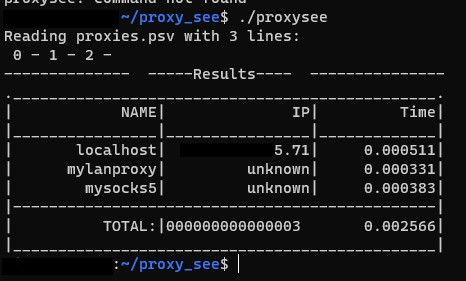

# Proxy See
A simple c program to poke proxies, check their health and reponse time.

# Dependencies
This program needs you to have installed 
- curl -> to make the requests
- gcc -> to compile main.c

# Instalation 
- Clone this repository
```shell
git clone https://github.com/dirop1/proxy_see.git && cd proxy_see
```
- compile 
```
gcc main.c -o proxysee
```
- place the file with the list of proxies you want to check you have one to edit in this repo

- run it with the file proxies.psv in the current directory
```shell
proxysee
```
- or run it passing the path to the file
```shell
proxysee "~/longproxylist.psv"
```
- wait for the results



## Other info

- Comments start with #
- if a proxy contains "localhost" in name or "none" in url it will be 
- uses ipify.org api you can change it on the line -> IP_API 
- proxies in proxies.psv must be in the format -> proxy_name|proxy_url

### Motivation

I was studying C and tried to develop something that maybe i can use again. And here's what i came up with. It's far from a perfect program just works.

